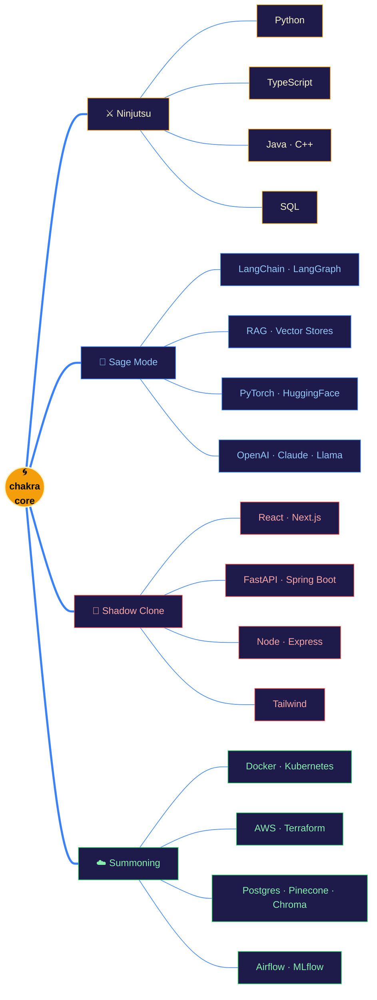

<!-- ═══════════════════════════════════════════════════════════════════ -->
<!--   THE NINJA CODEX  ·  Yaswanth Thottempudi  ·  github.com/YASWANTHthottempudi -->
<!-- ═══════════════════════════════════════════════════════════════════ -->

<p align="center">
  
</p>

<p align="center">
  <a href="https://www.linkedin.com/in/yaswanth-thottempudi-2720b221a/"></a>
  &nbsp;<a href="mailto:yaswanththottempudi@gmail.com"></a>
  &nbsp;<a href="https://github.com/YASWANTHthottempudi"></a>
  &nbsp;
  &nbsp;
  &nbsp;
</p>

<br/>

> ```
>   ┌─ COLD OPEN ──────────────────────────────────────────────────────────┐
>   │                                                                      │
>   │   "A shinobi who masters one jutsu is dangerous.                     │
>   │    A shinobi who masters the stack is unstoppable."                  │
>   │                                                       — sensei, 上忍   │
>   │                                                                      │
>   └──────────────────────────────────────────────────────────────────────┘
> ```

<p align="center"></p>

## 🍥 &nbsp;Episode 01 &nbsp;·&nbsp; The Profile Sheet

```yaml
# ~/konoha/registry/yaswanth.yaml
shinobi:
  name:       Yaswanth Thottempudi
  affiliation: Texas Tech University  ·  Full-Stack Developer (Grad. Asst.)
  education:  M.S. Computer Science    ·  GPA  3.88 / 4.00
  location:   Austin, TX  🇺🇸

specialties:
  primary:   [ Agentic AI, RAG pipelines, LLM apps      ]
  secondary: [ Full-stack web, distributed systems      ]
  signature: "Multi-Shadow-Clone Engineering — ship five features in parallel."

active_arc:
  - 🌀  multi-agent orchestration with LangGraph + CrewAI
  - 📜  retrieval pipelines that cite their sources
  - ⚔️  production-grade full-stack ships, end-to-end
```

<p align="center"></p>

## 🌐 &nbsp;Episode 02 &nbsp;·&nbsp; The Chakra Network

> _Forget skill bars. This is how the chakra actually flows._



<p align="center"></p>

## ⚡ &nbsp;Episode 03 &nbsp;·&nbsp; Chakra Reserves

> _Self-assessed mastery, sealed in the scroll._

```text
   technique               reserve                                    lv.
   ─────────────────────────────────────────────────────────────────────
   Python                  ████████████████████░░  ▮▮▮▮▮▮▮▮▮▮         92
   LangChain · LangGraph   ██████████████████░░░░  ▮▮▮▮▮▮▮▮▮          88
   RAG / Vector Retrieval  ██████████████████░░░░  ▮▮▮▮▮▮▮▮▮          87
   FastAPI · Python Web    █████████████████░░░░░  ▮▮▮▮▮▮▮▮           83
   React · Next.js         ████████████████░░░░░░  ▮▮▮▮▮▮▮▮           78
   TypeScript              ███████████████░░░░░░░  ▮▮▮▮▮▮▮            74
   PyTorch · ML            ██████████████░░░░░░░░  ▮▮▮▮▮▮▮            71
   Docker · Kubernetes     █████████████░░░░░░░░░  ▮▮▮▮▮▮             68
   AWS · Terraform         █████████████░░░░░░░░░  ▮▮▮▮▮▮             66
   Java · Spring Boot      ████████████░░░░░░░░░░  ▮▮▮▮▮▮             63
   ─────────────────────────────────────────────────────────────────────
                                              ↑ training arc continues ↑
```

<p align="center"></p>

## 📜 &nbsp;Episode 04 &nbsp;·&nbsp; The Mission Archive

> _Five sealed scrolls. Five chakra-intensive missions. No filler arcs._

### `MISSION 001` &nbsp; <kbd>S-RANK</kbd> &nbsp;·&nbsp; **Quiz-Tutor-Agent**

```text
   ╔══════════════════════════════════════════════════════════════════════╗
   ║  CLASSIFIED  ▍▍▍   AGENTIC TUTORING SYSTEM   ▍▍▍   RANK · S          ║
   ╠══════════════════════════════════════════════════════════════════════╣
   ║  Objective  ::  Generate 500+ unique, curriculum-grounded questions  ║
   ║                 from arbitrary study material — no cloud calls.      ║
   ║  Jutsu      ::  Llama 3.2 (local) · LangChain · ChromaDB · RAG       ║
   ║  Outcome    ::  zero-cost inference, 92% pedagogical relevance,      ║
   ║                 deployable on a single workstation.                  ║
   ╚══════════════════════════════════════════════════════════════════════╝
```
🔗 [github.com/YASWANTHthottempudi/Quiz-Tutor-Agent](https://github.com/YASWANTHthottempudi/Quiz-Tutor-Agent)

---

### `MISSION 002` &nbsp; <kbd>S-RANK</kbd> &nbsp;·&nbsp; **JobOutreach-Agent**

```text
   ╔══════════════════════════════════════════════════════════════════════╗
   ║  CLASSIFIED  ▍▍▍   AUTONOMOUS OUTREACH AGENT   ▍▍▍   RANK · S        ║
   ╠══════════════════════════════════════════════════════════════════════╣
   ║  Objective  ::  Multi-step agent that researches roles, drafts       ║
   ║                 personalised outreach, sends, and follows up.        ║
   ║  Jutsu      ::  LangGraph planner · tool-routing · self-correction   ║
   ║  Outcome    ::  cuts a half-day of application work down to minutes; ║
   ║                 backtracks gracefully on tool failure.               ║
   ╚══════════════════════════════════════════════════════════════════════╝
```
🔗 [github.com/YASWANTHthottempudi/JobOutreach-Agent](https://github.com/YASWANTHthottempudi/JobOutreach-Agent)

---

### `MISSION 003` &nbsp; <kbd>S-RANK</kbd> &nbsp;·&nbsp; **ResearchPaper-Q-A-Agent**

```text
   ╔══════════════════════════════════════════════════════════════════════╗
   ║  CLASSIFIED  ▍▍▍   CITATION-GROUNDED RAG   ▍▍▍   RANK · S            ║
   ╠══════════════════════════════════════════════════════════════════════╣
   ║  Objective  ::  Q&A over 200+ research PDFs with exact citations.    ║
   ║  Jutsu      ::  page-aware chunking · hybrid BM25 + dense retrieval  ║
   ║  Outcome    ::  ~85% answer accuracy, sources always traceable to    ║
   ║                 the paragraph that produced the answer.              ║
   ╚══════════════════════════════════════════════════════════════════════╝
```
🔗 [github.com/YASWANTHthottempudi/ResearchPaper-Q-A-Agent](https://github.com/YASWANTHthottempudi/ResearchPaper-Q-A-Agent)

---

### `MISSION 004` &nbsp; <kbd>A-RANK</kbd> &nbsp;·&nbsp; **ECommerce_Store**

```text
   ╔══════════════════════════════════════════════════════════════════════╗
   ║  CLASSIFIED  ▍▍▍   FULL-STACK STOREFRONT   ▍▍▍   RANK · A            ║
   ╠══════════════════════════════════════════════════════════════════════╣
   ║  Objective  ::  Production storefront — 200+ SKUs, real payments.    ║
   ║  Jutsu      ::  Stripe checkout · Cloudinary CDN · auth · admin UI   ║
   ║  Outcome    ::  end-to-end purchase flow, idempotent webhooks,       ║
   ║                 signature-replay-safe.                               ║
   ╚══════════════════════════════════════════════════════════════════════╝
```
🔗 [github.com/YASWANTHthottempudi/ECommerce_Store](https://github.com/YASWANTHthottempudi/ECommerce_Store)

---

### `MISSION 005` &nbsp; <kbd>A-RANK</kbd> &nbsp;·&nbsp; **React_Chatbot**

```text
   ╔══════════════════════════════════════════════════════════════════════╗
   ║  CLASSIFIED  ▍▍▍   POLY-PROVIDER CHAT SURFACE   ▍▍▍   RANK · A       ║
   ╠══════════════════════════════════════════════════════════════════════╣
   ║  Objective  ::  One UI. Five LLM providers. Streaming. No lock-in.   ║
   ║  Jutsu      ::  OpenAI · Claude · Gemini · DeepSeek · Grok routing   ║
   ║  Outcome    ::  provider fail-over, persisted threads, model picker  ║
   ║                 with cost & latency cues.                            ║
   ╚══════════════════════════════════════════════════════════════════════╝
```
🔗 [github.com/YASWANTHthottempudi/React_Chatbot](https://github.com/YASWANTHthottempudi/React_Chatbot)

<p align="center"></p>

## 📡 &nbsp;Episode 05 &nbsp;·&nbsp; The Mission Log

```bash
$ git log --oneline --decorate --graph --all  # most recent training arcs

* 8f3a2c1  (HEAD → main, tag: quiz-tutor/v2)  feat(rag): hybrid BM25 + dense — recall +18%
* 9b1d44e  feat(agent): joboutreach planner backtracks on tool failure
* 2c9e7a8  feat(rag): page-aware chunking; citations now exact to paragraph
* d5f8b21  hotfix(stripe): idempotency keys + signature replay defence
* 7e3a09f  feat(chatbot): provider fail-over → OpenAI ▶ Claude ▶ DeepSeek
* a14fc02  perf(embeddings): kage-bunshin-no-jutsu — 4× parallel ingestion
* 6c20de3  chore: prune dead chakra — drop 12 unused deps, bundle −38%
```

<details>
<summary><b>📂 &nbsp;Open the bingo book — full jutsu list</b></summary>

<br/>

| Domain        | Techniques                                                                         |
| ------------- | ---------------------------------------------------------------------------------- |
| **Languages** | Python · TypeScript · JavaScript · Java · C++ · SQL                                |
| **AI / GenAI**| LangChain · LangGraph · CrewAI · HuggingFace · OpenAI · PyTorch · TensorFlow · scikit-learn · OpenCV |
| **Backend**   | FastAPI · Node · Express · Spring Boot                                             |
| **Frontend**  | React · Next.js · Tailwind                                                         |
| **Data**      | PostgreSQL · MongoDB · Redis · Pinecone · Chroma · Neo4j                           |
| **Cloud**     | AWS · Docker · Kubernetes · Terraform · GitHub Actions                             |
| **MLOps**     | MLflow · Airflow · Spark                                                           |

</details>

<p align="center"></p>

## 🤝 &nbsp;Episode 06 &nbsp;·&nbsp; The Summoning Scroll

```bash
$ ./summon --form-squad

  ◢ linkedin  →  linkedin.com/in/yaswanth-thottempudi-2720b221a
  ◢ email     →  yaswanththottempudi@gmail.com
  ◢ github    →  github.com/YASWANTHthottempudi
  ◢ village   →  Austin, TX  ·  available worldwide (async)

>  scroll signed.  awaiting hand seals...
```

<p align="center"></p>

<p align="center">
  <sub><i>このコーデックスを読んでくれてありがとう — thanks for reading the codex.</i></sub><br/>
  <sub><b>Believe it.</b> ⚡ &nbsp; <code>// crafted hand-seal by hand-seal — no template, no Vercel widgets, no contribution snake</code></sub>
</p>
